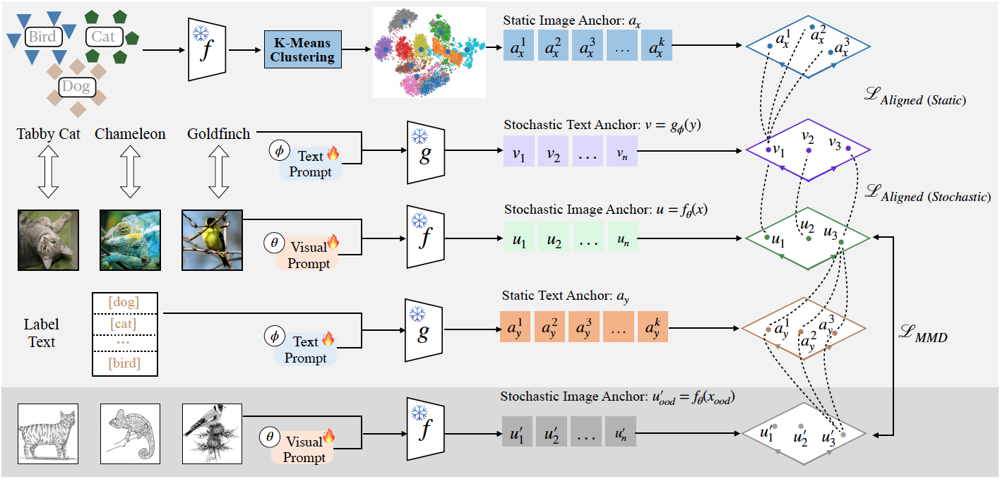

# [WACV 2025] Craft: Cross-modal Aligned Features Improve Robustness of Prompt Tuning


# Installation

This codebase is tested on Ubuntu 20.04.2 LTS with python 3.8. Follow the below steps to create environment and install dependencies.


* Setup conda environment (recommended).
```bash
# Create a conda environment
conda create -y -n craft python=3.8

# Activate the environment
conda activate maple

# Install torch (requires version >= 1.8.1) and torchvision
pip install torch==2.0.0 torchvision==0.15.1 torchaudio==2.0.1 --index-url https://download.pytorch.org/whl/cu118
```


* Clone this code repository and install requirements
```bash
# Clone MaPLe code base
git clone git@github.com:Jingchensun/Craft.git

cd Craft
# Install requirements

pip install -r requirements.txt

# Update setuptools package 
pip install setuptools==59.5.0
```

* Install Dassl Library.
```bash
# Instructions borrowed from https://github.com/KaiyangZhou/Dassl.pytorch#installation

# Clone this repo
git clone git@github.com:Jingchensun/Dassl.pytorch.git
cd Dassl.pytorch/

# Install dependencies
pip install -r requirements.txt

# Install this library (no need to re-build if the source code is modified)
python setup.py develop
cd ..
```


# Training and Evaluation

We provide bash scripts in 'train.sh' for each language prompting tuning and multi-modal prompt tuning.
Make sure to configure the dataset paths in environment variable `DATA` and run the commands from the main directory `multimodal-prompt-learning/`. Below we provide training and evaluation instructions for MaPLe.


### Trainiand Evaulation

The default training settings are provided in config file at `configs/trainers/MaPLe/vit_b16_c2_ep5_batch4_2ctx.yaml`. All hyper-parameters such as prompt length, prompt depth, etc., can be modified using this config file. When the ""

We provide bash scripts in [scripts/](../scripts) for language prompting and multi-modal prompt tuning.
When "DATASET.SUBSAMPLE_CLASSES" in the scripts is set as "ALL", that is used for in distribution setting; when "DATASET.SUBSAMPLE_CLASSES" is set as "Base", that is used for out of distribution setting.


```bash
# Other possible dataset values includes [caltech101, food101, dtd, ucf101, oxford_flowers, oxford_pets, fgvc_aircraft, stanford_cars, sun397, eurosat]

# seed=1, 2, 3
# trains and evaluates on base classes
bash scripts/maple/base2new_train_maple.sh imagenet 
# evaluates on novel classes
bash scripts/maple/base2new_test_maple.sh imagenet 

```

#### Averaging results over 3 seeds: 
Once the above trainings and evaluations are completed, the `output/` directory should have the following structure:

```
output
|–– base2new/
|   |–– test_new/
|   |   |–– imagenet/
|   |   |   |–– shots_16/
|   |   |   |   |–– MaPLe/
|   |   |   |   |   |–– vit_b16_c2_ep5_batch4_2ctx/
|   |   |   |   |   |   |–– seed1/
|   |   |   |   |   |   |–– seed2/
|   |   |   |   |   |   |–– seed3/
|   |–– train_base/
|   |   |–– imagenet/
|   |   |   |–– shots_16/
|   |   |   |   |–– MaPLe/
|   |   |   |   |   |–– vit_b16_c2_ep5_batch4_2ctx/
|   |   |   |   |   |   |–– seed1/
|   |   |   |   |   |   |–– seed2/
|   |   |   |   |   |   |–– seed3/
```

Now use the script `parse_test_res.py` and run the commands below to calculate the averaged results:
```bash
# prints averaged results for base classes
python parse_test_res.py output/base2new/train_base/imagenet/shots_16/MaPLe/vit_b16_c2_ep5_batch4_2ctx
# averaged results for novel classes
python parse_test_res.py output/base2new/test_new/imagenet/shots_16/MaPLe/vit_b16_c2_ep5_batch4_2ctx --test-log
```
The above steps can be repeated for other individual datasets.


## Acknowledgements

Our code is based on [CoOp](https://github.com/KaiyangZhou/CoOp) and [Maple](https://github.com/muzairkhattak/multimodal-prompt-learning) repository. We thank the authors for releasing their code. 

## Citing Craft

If you find this repository useful, please consider giving a star :star: and citation

```
@inproceedings{girdhar2023imagebind,
  title={Craft: Cross-modal Aligned Features Improve Robustness of Prompt Tuning},
  author={Jingchen Sun, Rohan Sharma, Vishnu Suresh Lokhande, Changyou Chen},
  booktitle={WACV},
  year={2025}
}
```